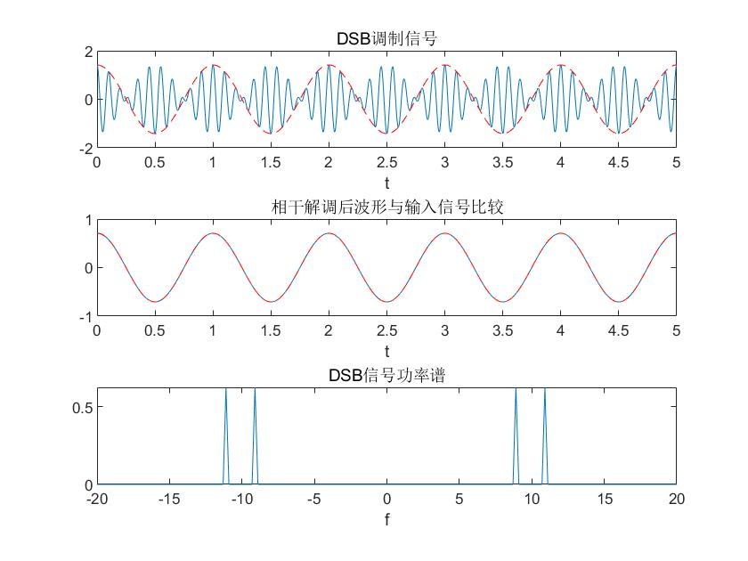
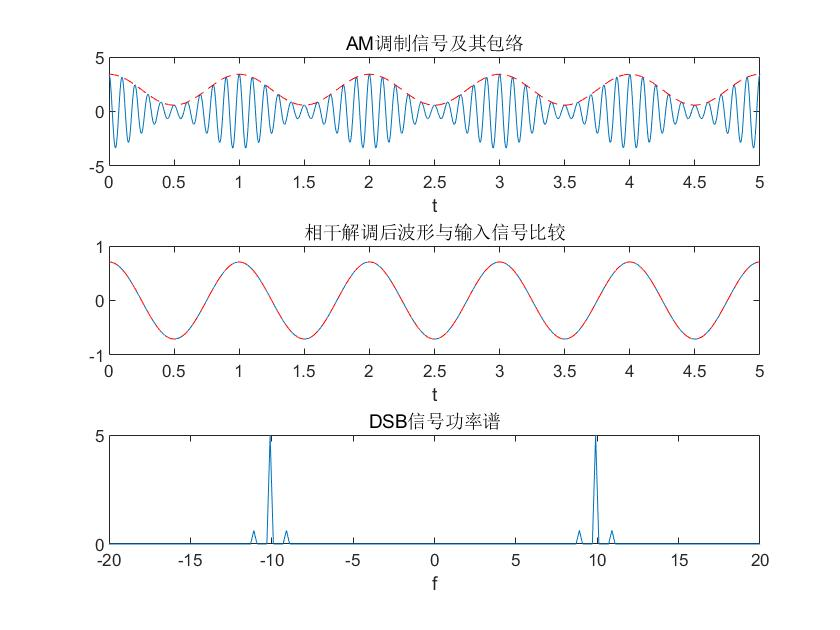

# 模拟调制

### 双边带抑制载波调幅（DSB-SC）

DSB-SC：

```matlab
%双边带抑制载波调幅（DSB-SC）没有直流分量，有直流分量的是AM
%产生一个频率为1Hz、功率为1的余弦信源，设载波频率为10Hz，画出相应波形

% 1. 画出DSB-SC调制信号
close all;
clear;
dt = 0.001; %时间采样间隔
fm = 1; %设置信源频率
fc = 10; %设置载波中心频率
T = 5; %信号持续时长
t = 0:dt:T; %生成采样点数组

mt = sqrt(2)*cos(2*pi*fm*t); %生成信源，根号2是为了方便后续操作凑整数
N0 = 0.01; %白噪声单边功率谱密度

s_dsb = mt.*cos(2*pi*fc*t); %DSB调制
B = 2*fm; %带宽
% noise = nosie_nb(fc,B,N0,t);
% s_dsb = s_dsb+noise;
figure(1)
subplot(3,1,1)
plot(t,s_dsb); %画出DSB波形
hold on;
plot(t,mt,'r--') %标示mt波形
title('DSB调制信号')
xlabel('t');

% 2. DSB解调
rt = s_dsb.*cos(2*pi*fc*t); % 相干解调

[f,rf] = T2F(t,rt);
[t,rt] = lpf(f,rf,2*fm);
subplot(3,1,2)
plot(t,rt);
hold on;
plot(t,mt/2,'r--');
title('相干解调后波形与输入信号比较')
xlabel('t')

subplot(3,1,3)
[f,sf] = T2F(t,s_dsb); % 求调制信号频谱
psf = (abs(sf).^2)/T;  % 求调制信号功率谱
plot(f,psf);
axis([-2*fc 2*fc 0 max(psf)]);
title('DSB信号功率谱');
xlabel('f');
```



### 双边带调幅（AM）

AM:

```matlab
%用MATLAB产生频率为1Hz，功率为1的余弦信源m(t)，设载波频率为10Hz，A=2，
%画出（1）AM调制信号
%（2）调制信号功率谱密度
%（3）相干解调后的信号波形
dt = 0.0001;
fm = 1;
fc = 10;
T = 5;
t = 0:dt:T;
mt = sqrt(2)*cos(2*pi*fm*t);

%AM调制
A = 2;
s_am = (A+mt).*cos(2*pi*fc*t);

figure(1)
subplot(3,1,1)
plot(t,s_am);
hold on;
plot(t,A+mt,'r--');
title('AM调制信号及其包络');
xlabel('t');

%AM解调
rt = s_am.*cos(2*pi*fc*t);
rt = rt-mean(rt);  % AM调幅需要
[f,rf] = T2F(t,rt);
[t,rt] = lpf(f,rf,2*fm);
subplot(3,1,2)
plot(t,rt);
hold on;
plot(t,mt/2,'r--');
title('相干解调后波形与输入信号比较')
xlabel('t')

subplot(3,1,3)
[f,sf] = T2F(t,s_am);
psf = (abs(sf).^2)/T;
plot(f,psf);
axis([-2*fc 2*fc 0 max(psf)]);
title('DSB信号功率谱');
xlabel('f');

```


