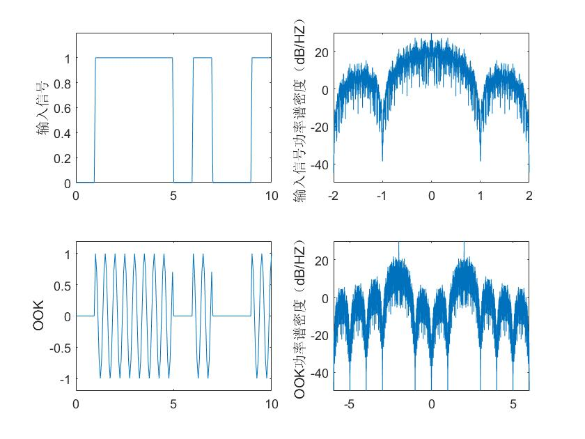
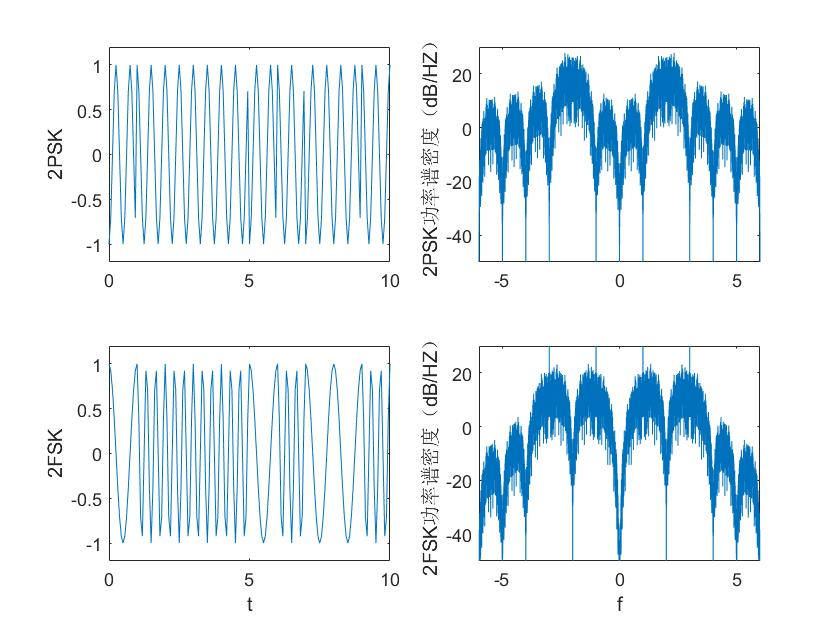
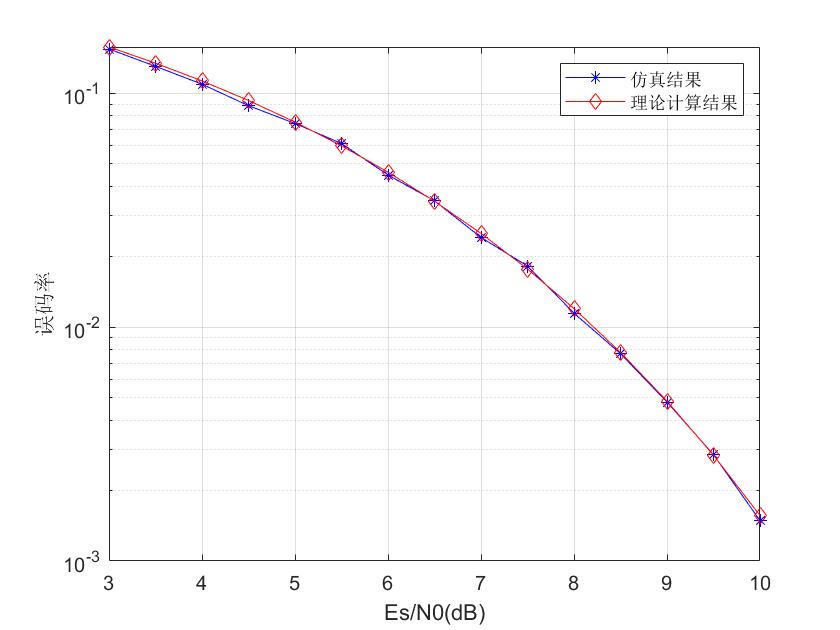

# 数字频带传输

### OOK,PSK,FSK

```matlab
% 生成OOK,2PSK,2FSK的信号波形及其功率谱
clear all;
close all;

A = 1;
fc = 2; % 2Hz
N_sample = 8;
N = 500; % 码元数
Ts = 1; % 1 Baud/s


dt = Ts/fc/N_sample; % 波形采样间隔
t = 0:dt:N*Ts-dt;
Lt = length(t);

%产生二进制信源
d = sign(randn(1,N));
dd = sigexpand((d+1)/2,fc*N_sample);
gt = ones(1,fc*N_sample); % NRZ波形

figure(1)
subplot(221)
% 输入单极性NRZ信号波形
d_NRZ = conv(dd,gt);
plot(t,d_NRZ(1:length(t)));
axis([0 10 0 1.2]);
ylabel('输入信号');

subplot(222)
% 输入NRZ频谱
[f,d_NRZf] = T2F(t,d_NRZ(1:length(t)));
plot(f,10*log10(abs(d_NRZf).^2/Ts));
axis([-2 2 -50 30]);
ylabel('输入信号功率谱密度（dB/HZ）');

% OOK信号
ht = A*cos(2*pi*fc*t);
s_2ask = d_NRZ(1:Lt).*ht;
subplot(223)
plot(t,s_2ask);
axis([0 10 -1.2 1.2]);
ylabel('OOK');

[f,s_2askf] = T2F(t,s_2ask);
subplot(224)
plot(f,10*log10(abs(s_2askf).^2/Ts));
axis([-fc-4 fc+4 -50 30]);
ylabel('OOK功率谱密度（dB/HZ）');

figure(2)
% 2PSK信号
d_2psk = 2*d_NRZ-1;
s_2psk = d_2psk(1:Lt).*ht;
subplot(221)
plot(t,s_2psk);
axis([0 10 -1.2 1.2]);
ylabel('2PSK');

subplot(222)
[f,s_2pskf] = T2F(t,s_2psk);
plot(f,10*log10(abs(s_2pskf).^2/Ts));
axis([-fc-4 fc+4 -50 30]);
ylabel('2PSK功率谱密度（dB/HZ）');

%2FSK
sd_2fsk = 2*d_NRZ-1;

s_2fsk = A*cos(2*pi*fc*t+2*pi*sd_2fsk(1:length(t)).*t);

subplot(223)
plot(t,s_2fsk);
axis([0 10 -1.2 1.2]);
xlabel('t');
ylabel('2FSK');


subplot(224)
[f,s_2fskf] = T2F(t,s_2fsk);
plot(f,10*log10(abs(s_2fskf).^2/Ts));
axis([-fc-4 fc+4 -50 30]);
xlabel('f');
ylabel('2FSK功率谱密度（dB/HZ）');
```






### QPSK

```matlab
%多进制数字调制
%信道加性高斯白噪声双边功率谱密度为N0/2，发送信号平均每符号能量E，仿真QPSK在AWGN信道下的性能
%利用MATLAB，通过蒙特卡洛仿真的方式得到MPSK系统的误码率

clear all;
close all;

M = 4; % QPSK

EsN0dB = 3:0.5:10;
EsN0 = 10.^(EsN0dB/10);
Es = 1;
N0 = 10.^(-EsN0dB/10);
sigma = sqrt(N0/2);

error = zeros(1,length(EsN0dB));
s_data = zeros(1,length(EsN0dB));

for k = 1:length(EsN0dB)
    error(k) = 0;
    s_data(k) = 0;
    while error(k)<1000
        d = ceil(rand(1,10000)*M); % 产生信源1,2,3,4均匀分布
        s = sqrt(Es)*exp(1j*2*pi/M*(d-1)); % 调制成QPSK信号（复基带形式）
        r = s+sigma(k)*(randn(1,length(d))+1j*randn(1,length(d))); % 加入信道噪声（复噪声）
        
        %判决
        for m = 1:M % 计算距离
            rd(m,:) = abs(r-sqrt(Es)*exp(1j*2*pi/M*(m-1)));
        end
        
        for m = 1:length(s) % 判决距离最近的点
            dd(m) = find(rd(:,m) == min(rd(:,m)));
            if dd(m) ~= d(m)
                error(k) = error(k)+1;
            end
        end
        s_data(k) = s_data(k)+10000;
    end
        
        
    
end

Pe = error./s_data;

%理论计算的误码结果
Ps = erfc(sqrt(EsN0)*sin(pi/M));
semilogy(EsN0dB,Pe,'b*-');
hold on;
semilogy(EsN0dB,Ps,'rd-');
grid on;
xlabel('Es/N0(dB)')
ylabel('误码率')
```



